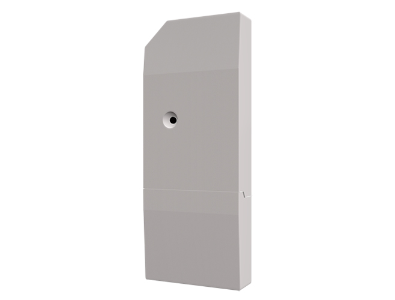
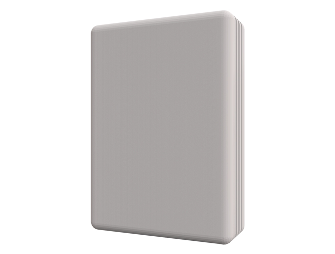

# udi-poly-intesis
Only fully tested with Daikin FDMQ and FTXS, with Intesis R0001 and I0001 HomeAutomation Wi-Fi interfaces.  It should work
for other brands of heat pumps as well with the Intesis interfaces, as they all seem to use
the same Intesis WMP protocol. See: 
https://www.intesis.com/products/ac-interfaces/wifi-gateways
YMMV
<p align="center">
  
  
</p>

### Variable substitution parameter examples:
For use in notifications these drivers can be used:
```
 Zone status:${sys.node.n022_cc3f1d02db4a.GV0}
 Zone fan state: ${sys.node.n022_cc3f1d02db4a.CLIFS}
 System mode: ${sys.node.n022_cc3f1d02db4a.CLIMD}
 Ambient Temp: ${sys.node.n022_cc3f1d02db4a.CLITEMP}
 Temp Setpoint: ${sys.node.n022_cc3f1d02db4a.CLISPH}
 Horiz Swing: ${sys.node.n022_cc3f1d02db4a.GV}
 Vert Swing :${sys.node.n022_cc3f1d02db4a.GV2}
```

###Add features:

###Version History:
3.0.0 March 20, 2023
- Initial release for PG3
