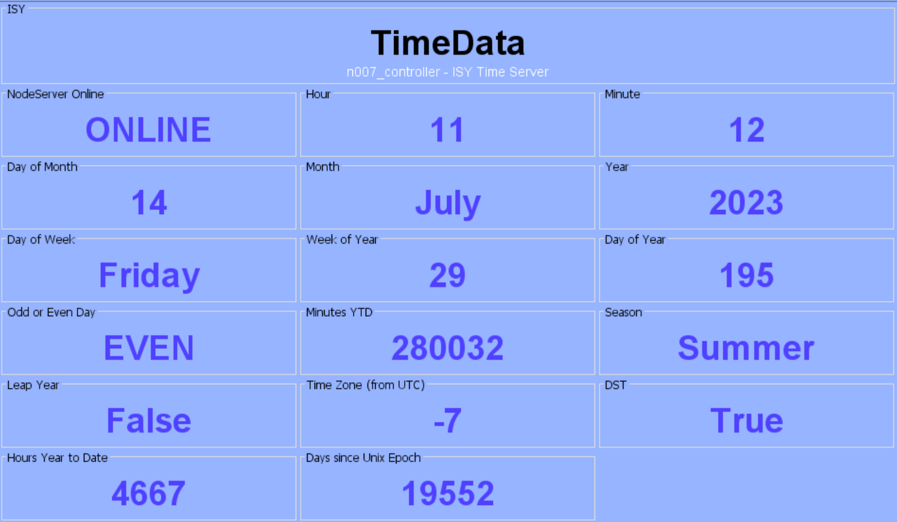
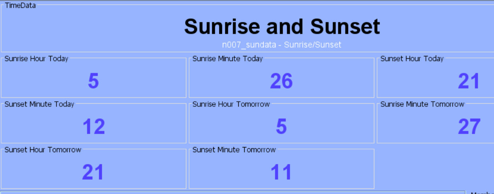

# Timedata Nodeserver
A Timedata node server for the Universal Devices ISY994

Copyright 2020, 2021, 2022 Gordon Larsen

#### Installation
Latitude and Longitude entries are required to determine sundata and hemisphere.
Timezone offset SHOULD be DST aware, but has not been tested for every timezone permutation.

Released for Polyglot V3 on Polisy

There have been some changes made during the migration to PG3. In particular, some node ids have changed. This means that
when using variable substitution, some updates to your Configuration/Customizations may be required.  For instance, the
"timedata" node was renamed to "controller", so instead of: ${sys.node.n007_timedata.GV5}, the script needs to be: ${sys.node.n007_controller.GV5}

#### Features
See the two images below for screen displays of data provided by the Node Server

#### Issues
Please post any issues encountered on the UDI Forum at "https://forum.universal-devices.com/forum/290-timedata/".  Github is not monitored.

## Release Notes
  - 3.2.24 22/04/2023
    - update nodeserver status
  - 3.2.23 20/03/2023
    - update requirements for latest udi_interface
  - 3.2.22 22/04/2022
    - minor profile updates.
  - 3.2.21 09/03/2022
    - fix sunrise/sunset calculations when time changes between DT and ST.
    - update requirements for udi_interface 3.0.36
  - 3.2.20 27/02/2022
    - add stop handler
  - 3.2.18 28/01/2022
    - update requirements for latest udi-interface
  - 3.2.16 21/10/2021
    - add code to fill sunnode fields on startup
  - 3.2.10 21/10/2021
    - updated and release for Polyglot V3
  - 2.2.10 13/05/2021
      - change calculation for epoch days to remove error caused by rounding.
  - 2.2.9 22/12/2020
      - profile update to 2.1.5
  - 2.2.8 05/12/2020
      - another profile update to 2.1.4
  - 2.2.7 05/12/2020   
      - update to profile 2.1.3, removing EN- from editors for future ISY compatibility
  - 2.2.6 13/06/2020   
      - update requirements for polyinterface 2.1.0
  - 2.2.5 20/03/2020
      - tweak for season calc for leapyear
  - 2.2.4 15/03/2020
      - add editor for year in timedata
  - 2.2.3 08/03/2020
      - fix sunrise/sunset tomorrow
  - 2.2.2 08/03/2020
      - replace sunrise/sunset algorithm with astral library. The algorithm didn't correctly calculate sunset on the first day of DST.  This may require deleting, uninstalling, reinstalling and re-adding to NS to install the new requirements.
  - 2.2.1 08/03/2020
      - revert to previous version for compatibility with Polisy
  - 2.2.0 08/03/2020
      - replace sunrise/sunset algorithm with ephem() library. The algorithm didn't correctly calculate sunset on the first day of DST.  This may require deleting, uninstalling, reinstalling and re-adding to NS to install the new requirements.
  - 2.1.1 28/02/202
      - a couple of user suggested changes to UOMs.
  - 2.1.0 27/02/2020
      - add hours since epoch and hours YTD per user requests.  This will require delete/add of NS to install new drivers.
  - 2.0.4 26/02/2020
      - remove some stray non-unix characters that crept into one of the profile files, keeping it from loading properly
  - 2.0.3 25/02/2020
      - some changes to ranges, uoms and titles
  - 2.0.2 22/02/2020
      - remove leading zeros from driver updates
  - 2.0.1 19/02/2020
      - change sun driver UOMs
  - 2.0.0 18/02/2020
      - added secondary node with sunrise/sunset info 
  - 1.0.3 12/02/2020
      - update editors to include negative hours for timezone
  - 1.0.2 12/02/2020
      - fix leapyear code
  - 1.0.1 11/02/2020
      - fix incorrect editor for month
  - 1.0.0 09/02/2020 
      - Initial release.
